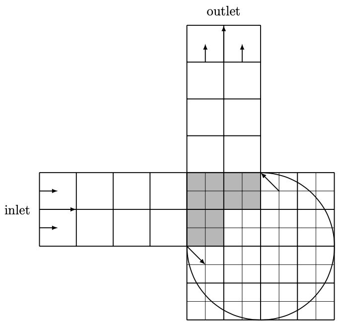
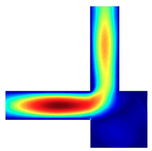
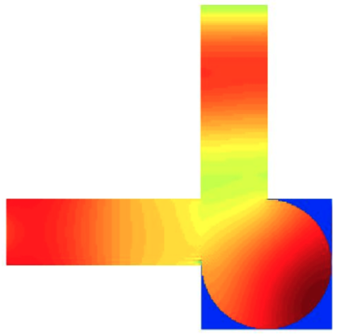
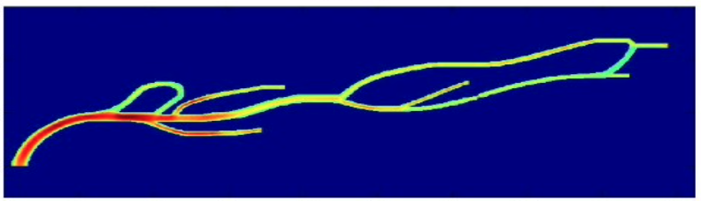
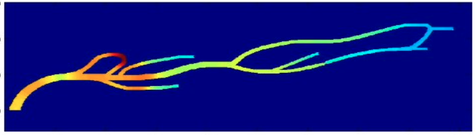

# MMLBM
Multiblock and multigrid lattice Boltzmann methods in domain of complex geometries

This MATLAB library implements the examples of lattice Boltzmann methods in the thesis  
[The Lattice Boltzmann Method for Fluid Dynamics: Theory and Applications](https://github.com/cpempire/MMLBM/tree/master/thesis)

 

which includes 
- Poiseuille flow, 
- lid driven cavity flow, 
- Womersley flow, 
- Taylor-Couette flow, 
- blood flow in aneurysms, etc. 

 
This library also includes the most common schemes for imposing boundary conditions on both straight and curved boundaries. Moreover, it features multiblock and multigrid implementation that enables the lattice Boltzmann methods to more practical applications, where multiscale physical problem in complex geometries.

