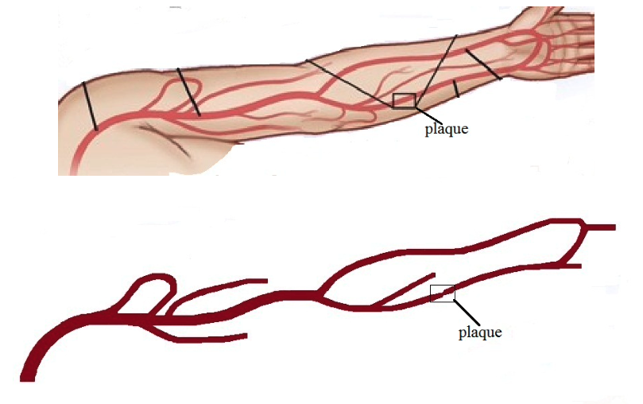

# MMLBM
Multiblock and multigrid lattice Boltzmann methods in domain of complex geometries

This MATLAB library implements the examples of lattice Boltzmann methods in the thesis  
[The Lattice Boltzmann Method for Fluid Dynamics: Theory and Applications](https://github.com/cpempire/MMLBM/tree/master/thesis)

 

which includes 
- Poiseuille flow, 
- lid driven cavity flow, 
- Womersley flow, 
- Taylor-Couette flow, 
- blood flow in aneurysms, etc. 

 
This library also includes the most common schemes for imposing boundary conditions on both straight and curved boundaries. Moreover, it features multiblock and multigrid implementation that enables the lattice Boltzmann methods to more practical applicationsin complex geometries, as shown in the following examples of blood flow (velocity and pressure) in cerebral aneurysms and artery with narrowed plaque.

